# used_car
# 🚗 Used Car Price Analysis with Big Data Techniques

This project analyzes used car listings from Carvana to uncover how vehicle mileage, manufacturing year, and brand affect resale prices. It includes Python-based data analysis, a regression model, and an interactive Power BI dashboard to present insights.

---

## 📌 Project Overview

- **Student Name**: NSHUTI MUGABO Arsene (27668)  
- **Instructor**: Eric MANIRAGUHA  
- **Course**: INSY 8413 | Introduction to Big Data Analytics  
- **Semester**: 2024–2025 (Sem III)  
- **Sector**: Transportation  
- **Dataset Source**: Carvana (via OpenDataBay)  
- **Total Records**: 22,000+  
- **Goal**: Identify key pricing factors and determine which car brands retain value over time.

---

## ❓ Problem Statement

> **"Can we identify key factors that influence used car prices and determine which brands retain value better over time?"**

---

## 🧪 Methodology

1. **Dataset Cleaning**
   - Removed invalid years and extreme outliers
   - Created new features: `Car_Age`, `MileageGroup`, `Brand`

    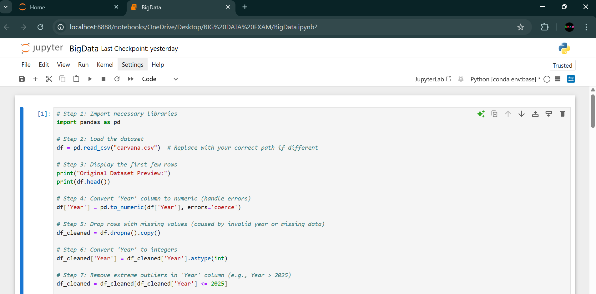
    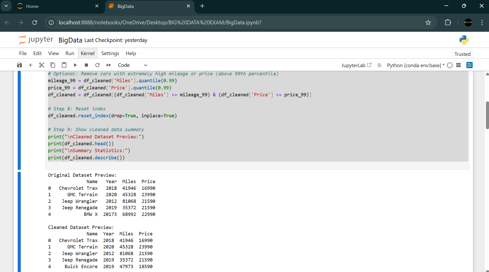
    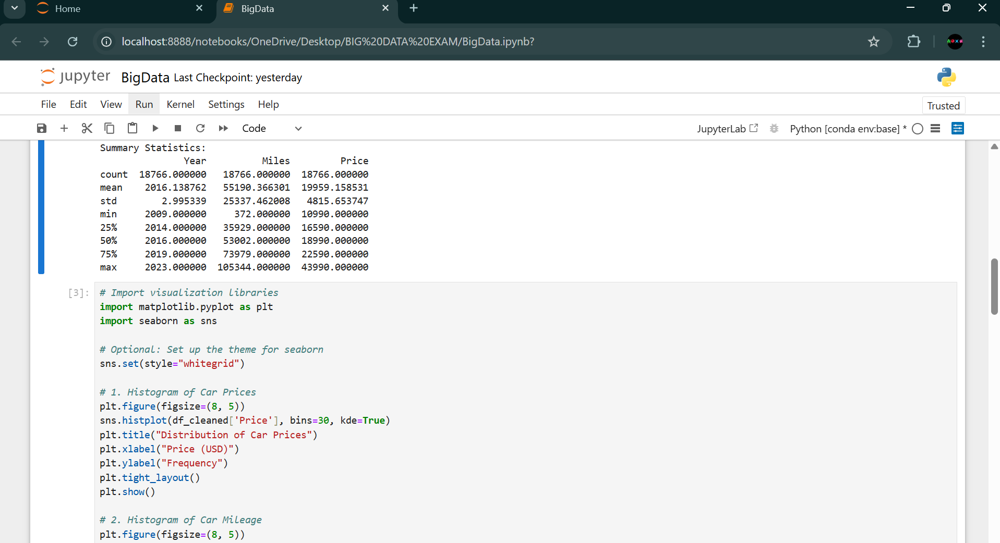

3. **Exploratory Data Analysis (EDA)**
   - Analyzed price distribution, mileage impact, and year-based trends
   - Visualized data using Seaborn and Matplotlib

     
     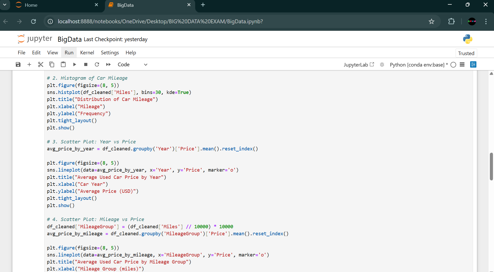
     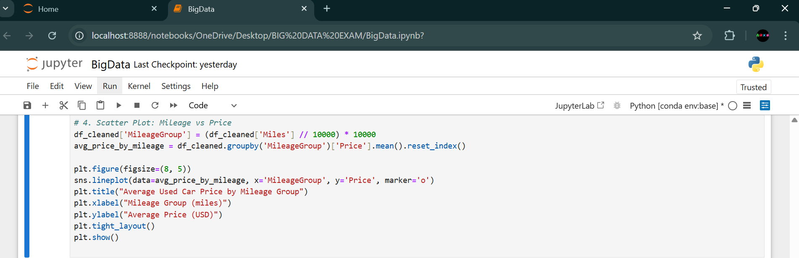
     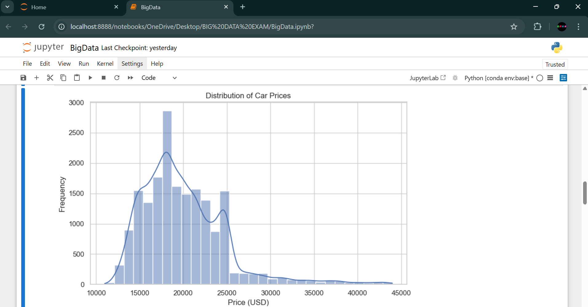
     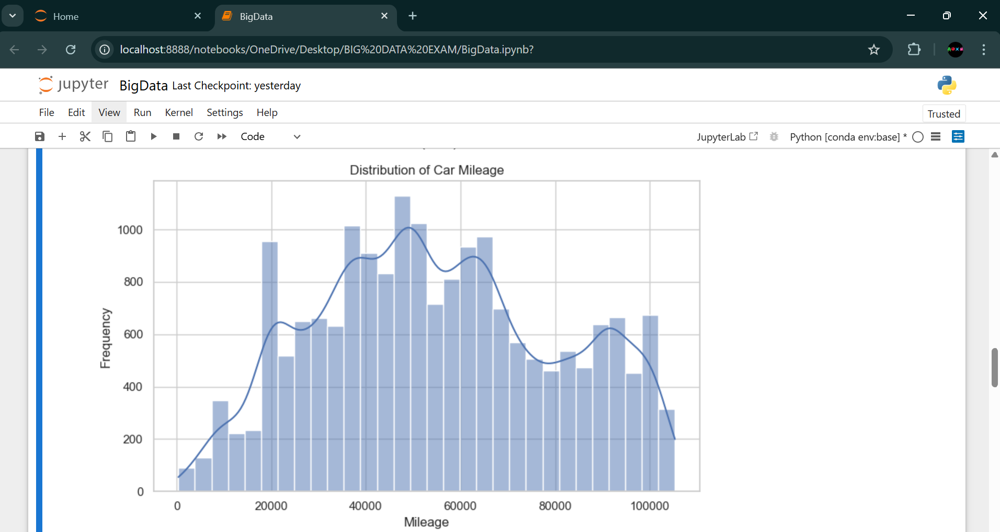
     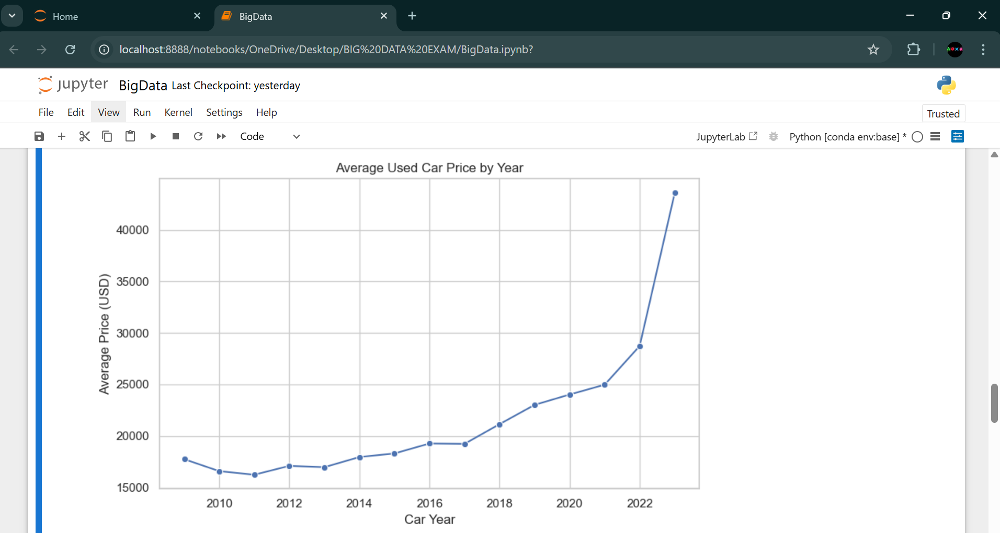
     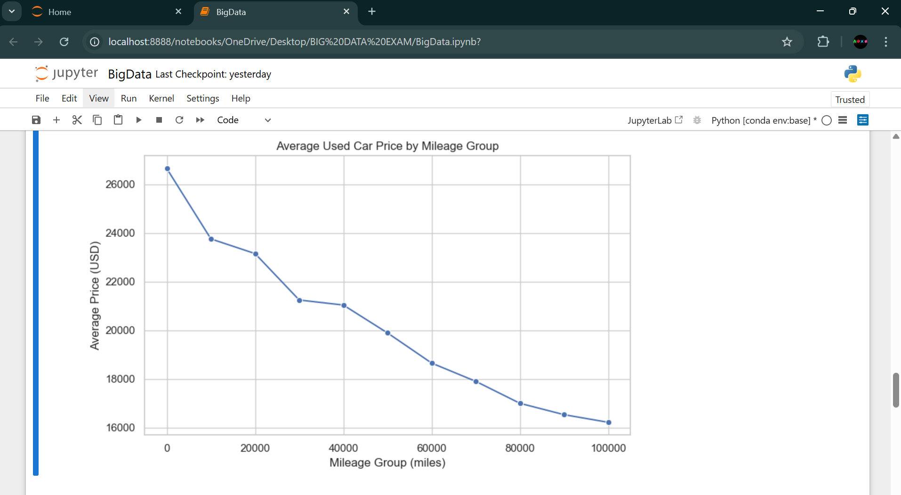

4. **Machine Learning Model**
   - Model: Linear Regression  
   - Features: `Year`, `Miles`  
   - RMSE: ~$3,915  
   - R² Score: ~37%  
   - **Equation**: `Price = 608 × Year - 0.06 × Miles - 1,203,040`

     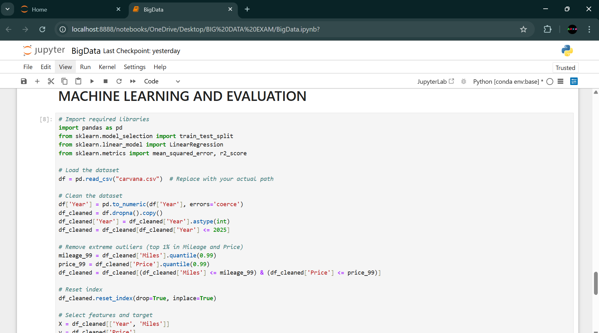
     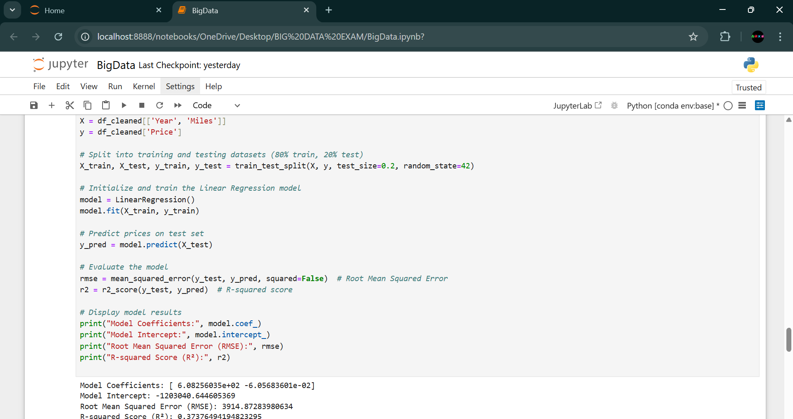

5. **Power BI Dashboard**
   - Visuals: Line charts, scatter plot, KPI cards, slicers
   - Interactivity via filters for year, mileage, brand
  
     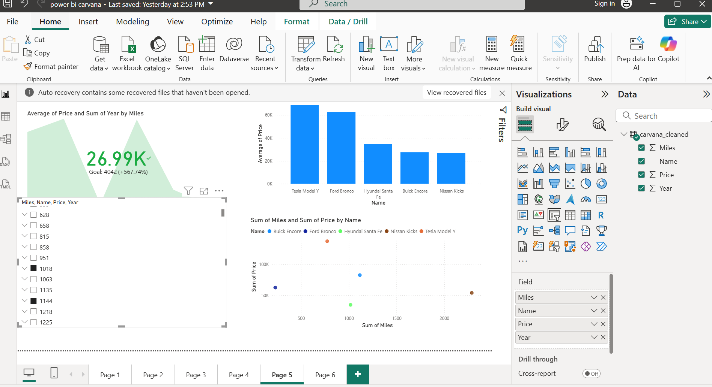

---

## 📊 Key Insights

- **Average Used Car Price**: ~$20,700  
- **Newer Cars** = Higher Prices  
- **Higher Mileage** = Lower Prices  
- **BMW & Jeep** hold value better than economy brands

---

## 💡 Recommendations

- Buyers should target 2015–2019 models with moderate mileage for best value.
- Sellers should highlight age and mileage to position cars competitively.
- Investment-focused buyers should consider value-retaining brands like **BMW** and **Jeep**.

---

## 🔮 Future Work

- Add fuel type and car location for richer insights
- Expand analysis by region or dealership clusters
- Train advanced ML models (Random Forest, XGBoost)
- Automate real-time price updates via external APIs

---

